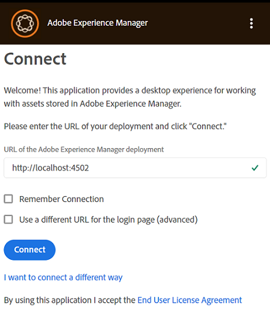
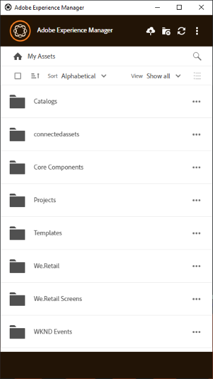

# Installeren [!DNL Adobe Experience Manager] bureaubladtoepassing {#install-app-v2}

Met de [!DNL Adobe Experience Manager] bureaubladtoepassing, de middelen binnen [!DNL Experience Manager] zijn gemakkelijk beschikbaar op uw lokale bureaublad en kunnen in om het even welke inheemse Desktoptoepassingen worden gebruikt. Elementen kunnen worden voorvertoond, geopend in systeemeigen bureaubladtoepassingen, onthuld in Mac Finder of Windows Verkenner voor plaatsing in andere documenten en lokaal worden gewijzigd - de wijzigingen worden opgeslagen in [!DNL Experience Manager] wanneer u uploadt en er een nieuwe versie wordt gemaakt in de repository.

Een dergelijke integratie maakt het mogelijk verschillende rollen in de organisatie te vervullen:

* De elementen centraal beheren in [!DNL Experience Manager Assets].

* Open de middelen in om het even welke inheemse Desktoptoepassingen, met inbegrip van derdetoepassingen en in Adobe Creative Cloud. De gebruikers kunnen zich daarbij gemakkelijk aan de verschillende normen houden, waaronder branding.

Te gebruiken [!DNL Experience Manager] desktop-app:

* Zorg ervoor dat uw [!DNL Experience Manager] versie wordt ondersteund door [!DNL Experience Manager] bureaubladtoepassing. Zie de [systeemvereisten](release-notes.md).

* Download en installeer de toepassing. Zie [bureaubladtoepassing installeren](#install-v2) hieronder.

* Test de verbinding met behulp van een paar elementen. Zie [bladeren naar elementen en deze zoeken](using.md#browse-search-preview-assets).

## Systeemvereisten, vereisten en downloadkoppelingen {#tech-specs-v2}

Zie voor meer informatie de [[!DNL Experience Manager] Opmerkingen bij de release bureaubladapp](release-notes.md).

## Upgrade uitvoeren vanaf een vorige versie {#upgrade-from-previous-version}

Als u een gebruiker bent van v1.x van de bureaubladtoepassing, begrijpt u de verschillen en overeenkomsten tussen de vorige en de laatste versie van de app. Zie [nieuwe functies in bureaubladtoepassing](introduction.md#whats-new-v2) en [hoe de app werkt](release-notes.md#how-app-works).

>[!NOTE]
>
>Twee versies van de bureaubladtoepassing kunnen niet naast elkaar bestaan op een computer. Verwijder de andere versie voordat u een versie installeert.

Voer de volgende instructies uit om een upgrade uit te voeren van een vorige versie van de app:

1. Voordat u een upgrade uitvoert, moet u al uw middelen synchroniseren en uw wijzigingen uploaden naar [!DNL Experience Manager]. Zo voorkomt u dat bewerkingen verloren gaan wanneer u de app verwijdert.

1. Verwijder de vorige versie van de app. Selecteer bij het verwijderen de optie om de cache te wissen.

1. Start de computer opnieuw op.

1. [Downloaden](release-notes.md) en [installeren](#install-v2) de nieuwste app. Volg de onderstaande instructies.

## Installeren {#install-v2}

Voer de volgende stappen uit om de bureaubladtoepassing te installeren. Bestaande Adobe verwijderen [!DNL Experience Manager] bureaubladtoepassing v1.x voordat de nieuwste app wordt geïnstalleerd. Zie hierboven voor meer informatie.

1. Download het nieuwste installatieprogramma van de [releaseopmerkingen](release-notes.md) pagina.

1. Houd de URL en de referenties van uw [!DNL Experience Manager] handige implementatie.

1. Als u een upgrade uitvoert vanaf een andere versie van de app, raadpleegt u [upgrade-bureaubladtoepassing](#upgrade-from-previous-version).

1. Deze stap overslaan als u [!DNL Experience Manager] als [!DNL Cloud Service], [!DNL Experience Manager] 6.4.4 of hoger, of [!DNL Experience Manager] 6.5.0 of hoger. Zorg ervoor dat uw [!DNL Experience Manager] voldoet aan de compatibiliteitseisen die in de [releaseopmerkingen](release-notes.md). Download indien nodig de toepasselijke [compatibiliteitspakket](https://experience.adobe.com/#/downloads/content/software-distribution/en/aem.html?package=/content/software-distribution/en/details.html/content/dam/aem/public/adobe/packages/cq640/featurepack/adobe-asset-link-support) en installeer het met de [!DNL Experience Manager] Pakketbeheer als een [!DNL Experience Manager] beheerder. Als u een pakket wilt installeren, raadpleegt u [Hoe te met Pakketten werken](https://experienceleague.adobe.com/docs/experience-manager-65/administering/contentmanagement/package-manager.html).

1. Voer binair het installatieprogramma uit en volg de instructies op het scherm om te installeren.

1. In Windows wordt mogelijk gevraagd het installatieprogramma te installeren `Visual Studio C++ Redistributable 2015`. Volg de aanwijzingen op het scherm om de installatie uit te voeren. Als de installatie mislukt, wordt deze handmatig geïnstalleerd. Download het installatieprogramma van [hier](https://www.microsoft.com/en-us/download/details.aspx?id=52685) en installeer beide `vc_redist.x64.exe` en `vc_redist.x86.exe` bestanden. Voer de [!DNL Experience Manager] bureaubladtoepassing.

1. Start de computer opnieuw naar wens. Start en configureer de bureaubladtoepassing.

1. Als u verbinding wilt maken met een [!DNL Experience Manager] , klikt u op het app-pictogram in de lade en start de app. Geef het adres van de [!DNL Experience Manager] server in de indeling `https://[aem_server]:[port]/`.

   Klikken **[!UICONTROL Connect]** en geef de referenties op.

   

   *Afbeelding: Verbindingsscherm met invoerserveradres.*

   Selecteren **[!UICONTROL Remember Connection]** om te voorkomen dat u de verbindingsgegevens steeds opgeeft wanneer u zich aanmeldt bij de bureaubladtoepassing.

   >[!CAUTION]
   >
   >Zorg ervoor dat er geen voorloopspaties of navolgende spaties zijn voor of na het adres van de [!DNL Experience Manager] server. Anders kan de toepassing geen verbinding maken met de [!DNL Experience Manager] server.

1. Als de verbinding is gelukt, kunt u de lijst met mappen en middelen weergeven die beschikbaar zijn in de hoofdmap van het dialoogvenster [!DNL Experience Manager] DAM. U kunt vanuit de app door de mappen bladeren.

   

   *Afbeelding: De toepassing geeft de DAM-inhoud weer na de aanmelding*

1. ([!DNL Experience Manager] 6.5.1 of hoger) Als u een bureaubladtoepassing gebruikt met [!DNL Experience Manager] 6.5.1 of hoger, upgrade S3- of Azure-connector naar versie 1.10.4 of hoger. Zie [Azure-connector](https://experienceleague.adobe.com/docs/experience-manager-65/deploying/deploying/data-store-config.html#azure-data-store) of [S3-connector](https://experienceleague.adobe.com/docs/experience-manager-65/deploying/deploying/data-store-config.html#amazon-s-data-store).

   Neem contact op met de Klantenondersteuning van Adobe als u een klant van Adobe Managed Services (AMS) bent.

## Voorkeuren instellen {#set-preferences}

Als u voorkeuren wilt wijzigen, klikt u op  en **[!UICONTROL Preference]** . In de **[!UICONTROL Preferences]** past u de waarden van het volgende aan:

* [!UICONTROL Launch application on login].

* [!UICONTROL Show window when application starts].

* **[!UICONTROL Cache Directory]**: Locatie van de lokale cache van de app (deze bevat de lokaal gedownloade elementen).

* **[!UICONTROL Network Drive Letter]**: De stationsletter die wordt gebruikt om aan de [!DNL Experience Manager] DAM. Wijzig dit niet als u het niet zeker weet. De app kan aan elke stationsletter in Windows worden toegewezen. Als twee gebruikers elementen van verschillende stationsletters plaatsen, kunnen ze de elementen die door elkaar zijn geplaatst niet zien. Het pad van de elementen wordt gewijzigd. De elementen blijven in het binaire bestand (bijvoorbeeld INDD) staan en worden niet verwijderd. In de app worden alle beschikbare stationsletters vermeld en wordt standaard de laatst beschikbare letter gebruikt die doorgaans `Z`.

* **[!UICONTROL Maximum Cache Size]**: Toegestane cache op de vaste schijf in GB die wordt gebruikt voor het opslaan van lokaal gedownloade elementen.

* **[!UICONTROL Current cache size]**: Opslaggrootte van de lokaal gedownloade elementen. De informatie wordt alleen weergegeven nadat middelen zijn gedownload met de app.

* **[!UICONTROL Automatically download linked assets]**: De elementen die in de ondersteunde native Creative Cloud-apps worden geplaatst, worden automatisch opgehaald wanneer u het oorspronkelijke bestand downloadt.

* **[!UICONTROL Maximum number of downloads]**:  Wissel voorzichtig. Wanneer voor het eerst elementen worden gedownload (via de optie Tonen, Openen, Bewerken, Downloaden of een vergelijkbare optie), worden de elementen alleen gedownload als de batch minder dan dit nummer bevat. De standaardwaarde is 50. Niet wijzigen als u het niet zeker weet. Als u de waarde verhoogt, kan het langer duren en als u de waarde verlaagt, kunt u de benodigde elementen of mappen mogelijk niet in één keer downloaden.

* **[!UICONTROL Use legacy conventions when creating nodes for assets and folders]**:  Wissel voorzichtig. Met deze instelling kan de toepassing het gedrag van de v1.10-app emuleren tijdens het uploaden van mappen. In v1.10, respecteren de knoopnamen die in de bewaarplaats worden gecreeerd ruimten en het omhulsel van de omslagnamen die door de gebruiker worden verstrekt. In versie 2.1 van de app worden de extra spaties in de mapnamen echter geconverteerd naar streepjes. Bijvoorbeeld uploaden `New Folder` of `new   folder` leidt tot de zelfde knoop in de bewaarplaats als de optie niet wordt geselecteerd en het standaardgedrag in v2.1 wordt behouden. Als deze optie is geselecteerd, worden in de opslagplaats voor de bovenstaande twee mappen verschillende knooppunten gemaakt die overeenkomen met de werking van de v1.10-app.

  Het standaardgedrag van v2.1 blijft gelijk, dat wil zeggen, vervangt meerdere spaties in mapnamen door streepjes in de naam van de opslagplaats en zet deze om in namen van kleine letters.

* **[!UICONTROL Upload Acceleration]**:  Wissel voorzichtig. Bij het uploaden van elementen kan de toepassing gelijktijdige uploads gebruiken om de uploadsnelheid te verbeteren. U kunt de gelijktijdige uitvoering van het uploaden verhogen door de schuifregelaar naar rechts te verplaatsen. De schuifregelaar aan de linkerkant betekent geen gelijktijdige uitvoering (single-threaded upload), de middelste positie komt overeen met 10 gelijktijdige threads en de maximale limiet aan de rechterkant komt overeen met 20 gelijktijdige threads. Een hogere gelijktijdige limiet is meer hulpbronnenintensief.

Als u de niet-beschikbare voorkeuren wilt bijwerken, meldt u zich af van het dialoogvenster [!DNL Experience Manager] en vervolgens bijwerken. Nadat u de voorkeuren hebt bijgewerkt, klikt u op .


*Afbeelding: App-voorkeuren voor bureaublad.*

### Proxyondersteuning {#proxy-support}

[!DNL Experience Manager] desktop-app gebruikt de vooraf gedefinieerde proxy van het systeem om via HTTPS verbinding te maken met internet. De toepassing kan alleen verbinding maken met een netwerkproxy waarvoor geen extra verificatie is vereist.

Als u de instellingen van de proxyserver voor Windows configureert of wijzigt (Internet Options > LAN Settings), start u de [!DNL Experience Manager] bureaubladtoepassing voor de wijzigingen die van kracht worden. Proxyconfiguratie wordt toegepast wanneer u de bureaubladtoepassing start. Sluit de app en start de app opnieuw om de wijzigingen door te voeren.

Als uw proxy verificatie vereist, kan het IT-team de [!DNL Experience Manager Assets] URL in de montages van de volmachtsserver om het toepassingsverkeer toe te staan om door te gaan.

## De toepassing verwijderen {#uninstall-the-app}

Voer de volgende stappen uit om de installatie van de toepassing in Windows ongedaan te maken:

1. Upload al uw wijzigingen naar [!DNL Experience Manager] om te voorkomen dat bewerkingen verloren gaan. Zie [Elementen bewerken en bijgewerkte elementen uploaden naar [!DNL Experience Manager]](using.md#edit-assets-upload-updated-assets). Afmelden en [!UICONTROL Exit] de app.

1. Verwijder de app als u andere besturingssysteemtoepassingen verwijdert. Verwijder de software uit de programma&#39;s Toevoegen en Verwijderen in Windows.

1. Als u de cache en logbestanden wilt verwijderen, schakelt u het vereiste selectievakje in.

   

1. Volg de aanwijzingen op het scherm. Start de computer opnieuw op als deze klaar is.

Voer de volgende stappen uit om de installatie van de toepassing op Mac te verwijderen:

1. Upload al uw wijzigingen naar [!DNL Experience Manager] om te voorkomen dat bewerkingen verloren gaan. Zie [Elementen bewerken en bijgewerkte elementen uploaden naar [!DNL Experience Manager]](using.md#edit-assets-upload-updated-assets). Afmelden en [!UICONTROL Exit] de app.

1. Verwijder de `Adobe Experience Manager Desktop.app` van `/Applications`.

Als u de interne cache van toepassingen op Mac wilt opschonen en de toepassing wilt verwijderen, kunt u de volgende opdracht ook in de terminal uitvoeren:

```shell
/Applications/Adobe Experience Manager Desktop/Contents/Resources/uninstall-osx/uninstall.sh
```
